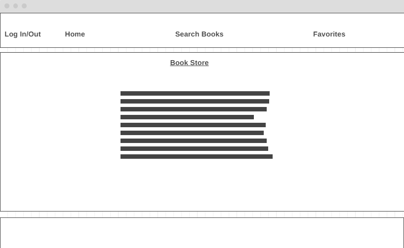

## React Book Store (Search App)

### Overview
Welcome to the React Book Store App! This web application allows users to search for books using the Google Books API. Users can view details of each book, including its image, title, description, and rating. Additionally, the app enables users to save their favorite books for future reference.

### Features
- Google Books API Integration: Utilizes the Google Books API to fetch book data based on user searches.
- Search Bar: Allows users to enter keywords in the search bar to find books of interest.
- Book Display: Presents a list of books matching the search criteria, displaying each book's image, title, description, and rating.
- Favorites: Enables users to save their favorite books for quick access later.

### Technologies Used
- React: JavaScript library for building user interfaces.
- Google Books API: Provides access to a vast collection of book information.
- CSS: Styling for a visually appealing user interface.


### Layout
##### Home Page


#### Search Page


#### Favorites Page


### Getting Started
Prerequisites
Node.js and npm installed on your machine.

### Installation
1. Clone the repository:

``` bash
git clone https://github.com/your-username/react-book-search-app.git
cd react-book-search-app
```
2. Install dependencies:
``` bash
npm install
npm install react-router-dom@6
```
3. Create a Google Books API key:
- Visit the Google Cloud Console.
- Create a new project and enable the Google Books API.
- Generate an API key.
- Copy the API key.

4. Create a .env file in the project root and add your API key:

``` env
REACT_APP_API_KEY={your-api-key}
```

### Usage
- Start the development server:
``` bash
npm start
```
- Open your browser and visit http://localhost:3000.
- Use the search bar to enter keywords and find books.
- View details of each book, including image, title, description, and rating.
- Save your favorite books by clicking the "Add to favorites" button.
